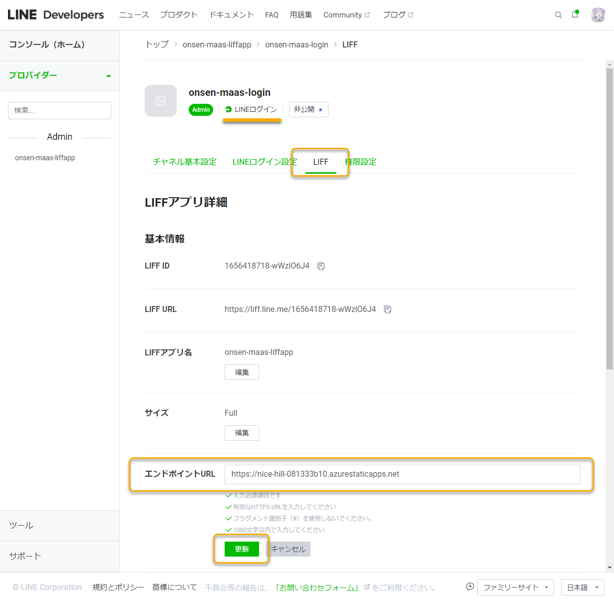
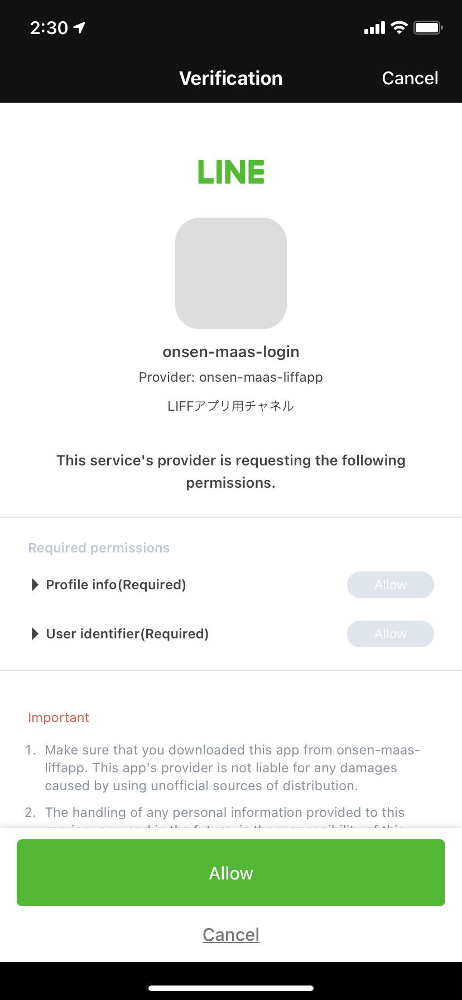

# LIFFアプリのエンドポイントを更新し、動作を確認する

控えておいた Azure Static Web App の URL を、LIFFアプリのエンドポイントとして設定します。

## LIFFアプリのエンドポイントを更新する

[LINE Developersコンソール](https://developers.line.biz/console/) を開き、作成したプロバイダーを開きます。

LINEログインチャネルの「LIFF」タブから、作成したLIFFアプリを開き、「Endpoint URL」を更新し、「更新」ボタンで保存します。

## LIFFアプリを公開する

LINEログインチャネルの「LIFF」タブのままで、画面上部の「Developing」を選択し、「Publish」を選択します。

## リッチメニューに LIFFアプリを設定する

Messaging APIチャネルの「チャネル基本設定」から、「LINE Official Account Manager」を開きます。

「LINE OFficial Account Manager」の画面上部の「ホーム」を開き、左のメニューの「トークルーム管理」→「リッチメニュー」を開きます。「作成」ボタンからリッチメニューの作成を行います。

「表示設定」で下記を設定します。

| 項目 | 説明 |
|----|----|
| タイトル | 任意のタイトル（ `LIFFアプリ` など）を入力する |
| 表示期間 | 任意の期間を入力する |

「コンテンツ設定」で下記を設定します。

まず「テンプレートを選択」ボタンを選択し、「小」の1画面のテンプレート（左下）を選択して「選択」ボタンを選択します。

「画像を作成」ボタンを選択し、下記の手順を行います。

- ダイアログ下部のアイコンから「背景色を追加」を選択し、任意の色を指定します。
- さらにダイアログ下部のアイコンから「テキストを追加」を選択し、任意の文字列（ `配車` など）を入力します。好みに応じて、「中央揃え」などで配置を整えてください。

「適用」ボタンを選択し、画像を適用するか確認されるので、「適用」を選択し進んでください。

「アクション」の「タイプ」を「リンク」に変更し、テキストボックスに控えておいた「LIFF URL」を入力します。「アクションラベル」に任意の文字列（ `タクシー配車サービス` など）を入力します。

以上の更新ができたら、「保存」ボタンから保存します。

## 動作を確認する

Messageing APIチャネルの「Messaging API設定」タブを開き、QRコードを使ってこのチャネルをフレンド登録しましょう。

 

チャットを開くと先ほど作成したリッチメニューが表示され、「配車」をタップするとLIFFアプリが立ち上がります。

 

LIFFアプリで各欄に入力し、「予約」ボタンから予約を行います。

 

しばらくすると上図右のように「タクシー配車予約を受け付けました。」というメッセージが届けば成功です！ :tada:
