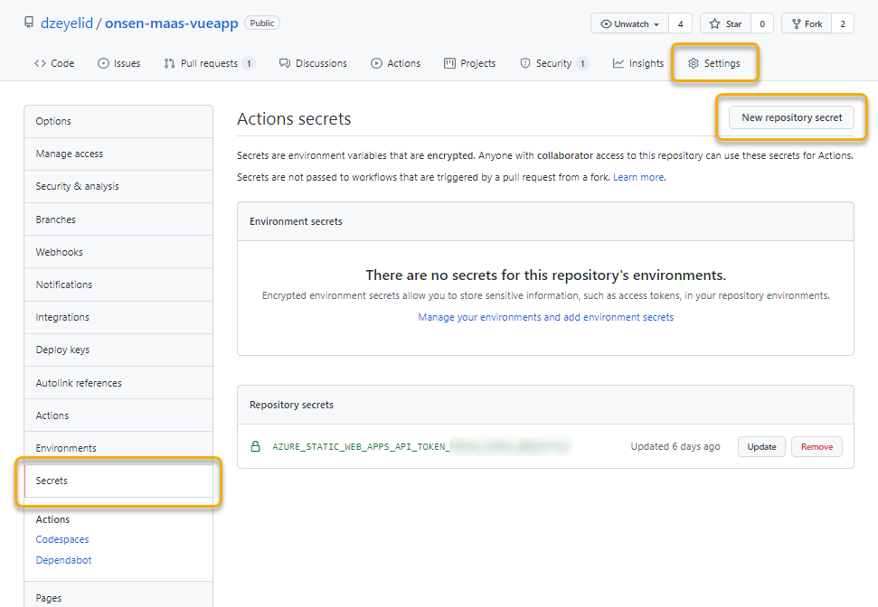
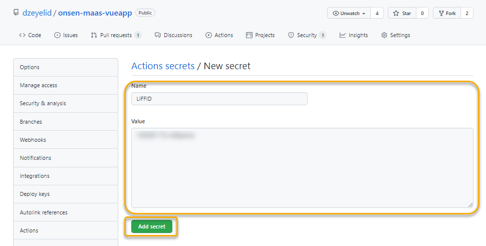
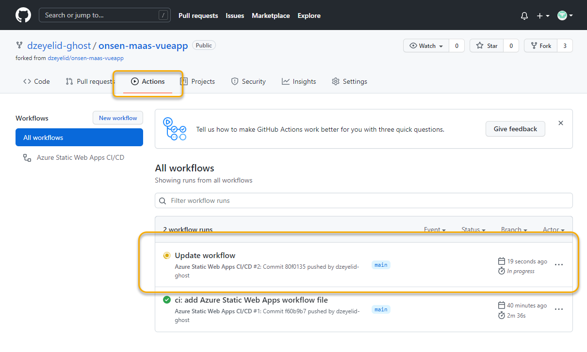
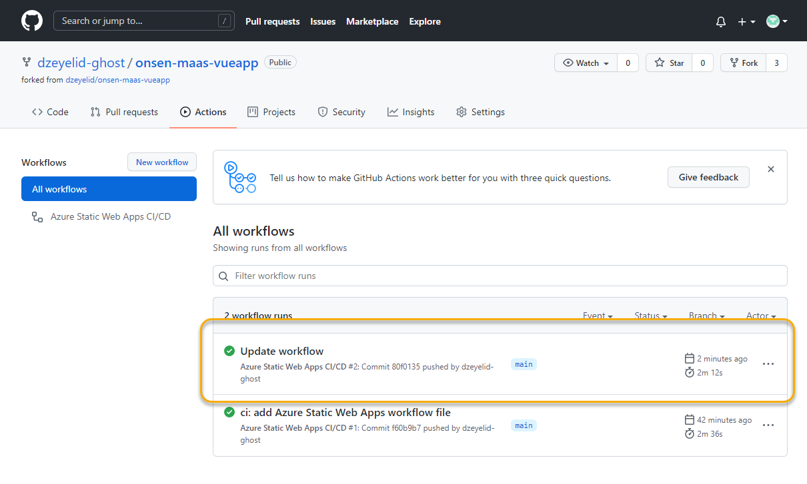

# ワークフローを更新する

LIFFアプリ（静的サイト）に下記の環境変数を設定するため、GitHub Actions のワークフローを更新します。

GitHub Actions のワークフローは、yml ファイルで定義し、`.github/workflows` 配下に配置します。

この時点では、前の手順で Azure Static Web App のリソースを作成した際にすでにワークフロー（`azure-static-web-apps-<RANDOM_NAME>.yml`）が作成されており、これを編集していきます。

> - [GitHub Actions 入門 - GitHub Docs](https://docs.github.com/ja/actions/learn-github-actions/introduction-to-github-actions)
> - [Azure Static Web Apps の GitHub Actions ワークフロー | Microsoft Docs](https://docs.microsoft.com/ja-jp/azure/static-web-apps/github-actions-workflow)

## リポジトリにシークレットを追加する

リポジトリの「Settings」から、「Secrets」を開きます。



右上の「New repository secret」ボタンから、下記の項目を入力し、シークレットを追加します。

| 項目 | 値 |
|----|----|
| Name | `LIFFID` |
| Value | LINEログインチャネルの「LIFF ID」 |



## ワークフローファイルを更新する

つぎに、ワークフローファイルを更新します。

編集方法は幾通りもありますが、ここでは、リポジトリをブラウザで開いた状態で `.` キーを押下し、 GitHub Dev のエディタを開いて編集してみます。

Visual Studio Code とほぼ同様の画面が開くので、ワークフローファイル `.github/workflows/azure-static-web-apps-<RANDOM_NAME>.yml` を開き、下記のように `uses: Azure/static-web-apps-deploy@v1` の下に `env` の設定を追加します。

```yml
      - name: Build And Deploy
        id: builddeploy
        uses: Azure/static-web-apps-deploy@v1
        # ↓↓ ここから ↓↓
        env:
          VUE_APP_LIFFID: ${{ secrets.LIFFID }}
          VUE_APP_USE_VCONSOLE: true
        # ↑↑ ここまで追加 ↑↑
        with:
          azure_static_web_apps_api_token: ${{ secrets.AZURE_STATIC_WEB_APPS_API_TOKEN_<RANDOM_NAME> }}
```

先の手順で追加したシークレットは、ワークフローの中で `${{ secrets.LIFFID }}` として参照することができます。

編集を保存したら、左メニューの「Source Control」を開き、そのまま `main` ブランチにコミットしてください。

リポジトリに戻るには、左下の「>< GitHub」から「Go to Repository」を選択してください。

## ワークフローの実行を確認する

`main` ブランチが更新されると、ワークフローが実行されるので、リポジトリの「Actions」タブを開き、ワークフローの状況を確認します。



ワークフローが正常に終了すればOKです。



----

[README に戻る](./#4-ワークフローを更新する)
